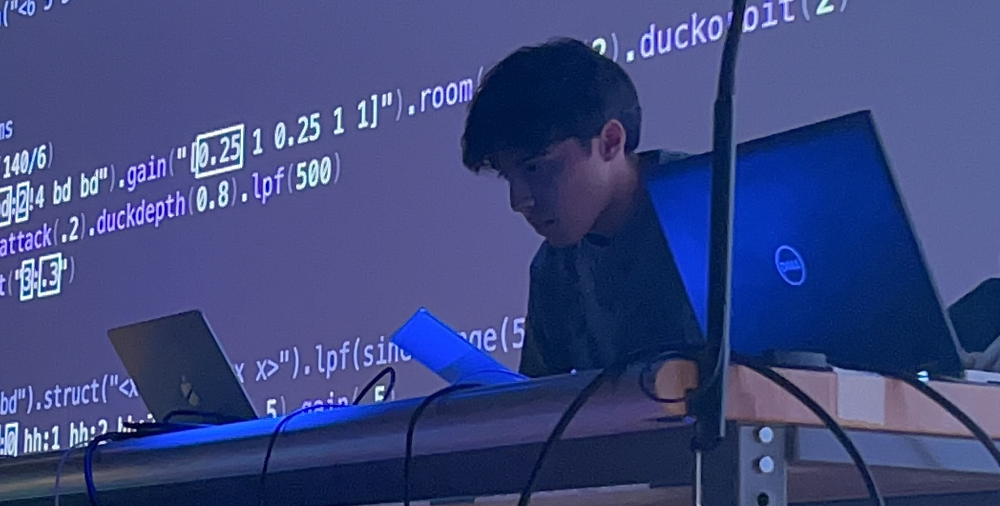

# coDAW

<p align="center">
  
</p>


A coding-first digital audio workstation that runs in the browser. Write JavaScript to define instruments, patterns, and effects! The code is rendered as draggable clips on a timeline that you can rearrange visually, edit note-by-note in a piano roll, play back, and record to an audio file.

The code is the essense: drag a clip, and the `start:` value in your code updates. Edit a melody in the piano roll, and the events array in your code rewrites itself. Re-run anytime to regenerate everything from the editor.

Final project for **COMS3430 (Spring 2026)** — Dr. Santolucito, Barnard College.

**Live demo:** https://andrew-bonilla.github.io/coDAW/

> ⚠️ **Work in progress.** This is an active project — features are still being added and refined.

## Motivation

I had the idea for coDAW from the live-coding performances we did in class using [Strudel](https://strudel.cc/). Watching music get built collaboratively from just code, with each person editing the code the previous person had written, layering and reworking ideas in real time, was unlike any music-making experience I've had before. It combined pair programming to a band jam session, and inspired me to explore more about this strange, new path into music. It made me realize how much of music production has been locked behind GUI-heavy DAWs that don't invest into that kind of fluid, iterative collaboration.

A code-first DAW changes the problem in a few ways I find exciting:

- **Automation and computation become native.** Loops, conditionals, generative patterns, and parametric sound design are just code. There is no need to draw automation lanes or wire up modulation chains by hand. Complex synths, sequences, and effect topologies that would take a long time to build by clicking and dragging can be expressed in a few lines. Furthermore, any of these complex, abstract customizations can be quantified into code and patterns, more objectively comprehendible, teachable, and shareable.
- **Music becomes diffable.** Once a song is turned into objective text, it exists naturally in Git. You can branch, fork, pull-request, and review music the same way you do code! This opens the door to GitHub-style collaboration on songs and sample packs in the future. Further updates could address this through a "coDAW pages" feature, layering different sounds together at once, so that developers can work on different features and branches to merge.
- **AI-assisted music editing becomes straightforward.** Because the entire composition is just a JavaScript file, an LLM can read it, reason about it, and propose edits via prompt — "make the bass groovier," "add a bridge in F# minor," "swap the lead synth for something darker." The code is the interface both humans and models can manipulate.

coDAW is my attempt to take what made Strudel sessions feel so creative and stretch it into something that looks and behaves more like a traditional DAW: a timeline, draggable clips, a piano roll, and a record button. All while having code as the essence underneath.

## Features

- **JavaScript DSL** for declaring instruments, patterns, effects, and timing
- **Eight synth types**: triangle, sawtooth, square, sine, am, fm, membrane, metal
- **Effects**: reverb, delay, lowpass filter — chained via `connect(instrument, effect)`
- **Two pattern modes**: simple string patterns (`'C4 E4 G4'`) and explicit event arrays for custom timing
- **Chord support** via the `+` syntax (`'C4+E4+G4'`)
- **Bidirectional code ↔ UI sync**: drag clips to update code, edit code to regenerate the timeline
- **Piano roll** for chromatic note editing (click to add, drag to move/resize, right-click to delete)
- **Animated playhead** with sample-accurate timing
- **Recording** via `Tone.Recorder` — captures the master output to a downloadable WebM file

## Stack

- **React 19** + **Vite 5**
- **Tone.js** (Web Audio synthesis, transport, recorder)
- **CodeMirror 6** (editor with JS syntax highlighting)
- **lucide-react** (icons)

## API reference

```js
bpm(120)                                 // Set the global tempo

// Create instruments
const lead = synth({
  type: 'fm',                            // triangle | sawtooth | square | sine | am | fm | membrane | metal
  label: 'Lead',
  volume: -8,                            // dB; 0 = unity, negative = quieter
  envelope: { attack: 0.02, decay: 0.1, sustain: 0.5, release: 0.5 },
})

// Create effects
const verb = effect('reverb', { decay: 2, wet: 0.4 })
const dly  = effect('delay',  { delayTime: '8n', feedback: 0.3 })
const filt = effect('filter', { frequency: 2200, type: 'lowpass' })

// Route an instrument through an effect
connect(lead, verb)

// Pattern mode A — uniform spacing via a string
play(lead, 'C4 E4 G4 ~ B4', {
  label: 'Melody',
  note_duration: '8n',                   // 1n | 2n | 4n | 8n | 16n
  start: 0,                              // measure offset
})

// Pattern mode B — explicit events with custom timing
play(lead, [
  { note: 'C4',     time: 0,   duration: '4n' },
  { note: 'E4+G4',  time: 1.5, duration: '8n' },   // chord via "+"
  { note: 'C5',     time: 2,   duration: '2n' },
], { label: 'Sequence', start: 0 })
```

### Generative helpers

These pure functions are available inside your code — they make computation-driven music writing way more concise.

```js
// scale(root, mode) — returns an array of notes in a musical scale
scale('C4', 'minor')      // → ['C4','D4','Eb4','F4','G4','Ab4','Bb4']
scale('A',  'minorPentatonic')
// Modes: major, minor, dorian, phrygian, lydian, mixolydian, locrian,
//        minorPentatonic, majorPentatonic, blues, chromatic

// chord(name, octave?) — returns a play()-ready chord string
chord('Cm')               // → 'C4+Eb4+G4'
chord('Cm7', 3)           // → 'C3+Eb3+G3+Bb3'
chord('Fmaj7')            // → 'F4+A4+C5+E5'
// Qualities: maj, m, min, dim, aug, 7, maj7, m7, dim7, sus2, sus4

// euclid(note, hits, steps) — generates an evenly-distributed rhythm
euclid('C1', 3, 8)        // → 'C1 ~ ~ C1 ~ ~ C1 ~'   (tresillo)
euclid('C1', 5, 8)        // → 'C1 ~ C1 ~ C1 C1 ~ C1' (cinquillo)
euclid('C1', 4, 16)       // → four-on-the-floor

// repeat(n, pattern) — concatenate a pattern n times
repeat(4, 'C4 E4')        // → 'C4 E4 C4 E4 C4 E4 C4 E4'
```

These compose naturally with `play()` — which also accepts arrays of note strings directly, so no `.join(' ')` is needed:

```js
// A walking minor scale
play(lead, scale('C4', 'minor'), { note_duration: '8n' })

// Euclidean kick pattern, two bars
play(kick, repeat(2, euclid('C1', 3, 8)), { note_duration: '8n' })

// A i–iv–V–i progression
play(piano, [
  { note: chord('Am'),  time: 0, duration: '2n' },
  { note: chord('Dm'),  time: 2, duration: '2n' },
  { note: chord('E7'),  time: 4, duration: '2n' },
  { note: chord('Am'),  time: 6, duration: '2n' },
])
```

## Running locally

```bash
npm install
npm run dev
```

The dev server starts at http://localhost:5173.

## Deploying

```bash
npm run deploy
```

This builds and pushes the production bundle to the `gh-pages` branch. GitHub Pages then serves it at the URL above.

## How it works

- **`src/audio/api.js`** — the user-facing DSL. Captures clips into module-level state during `runUserCode()`.
- **`src/audio/engine.js`** — wraps user code in a `new Function(...)` and schedules clips via `Tone.Part`. Handles play / stop / record.
- **`src/utils/codeUpdater.js`** — bracket-aware string manipulation that rewrites `start:` values and event arrays back into the source code when you drag clips or edit the piano roll.
- **`src/components/`** — Editor (CodeMirror), Timeline, Clip (draggable), PianoRoll, Playhead, Controls.

## Limitations

- No undo / redo
- Single transport: no looping, no per-clip playback
- Recorder outputs `.webm` (browser `MediaRecorder` default), not `.wav`
- Effects can't be chained (one effect per instrument)

## License

MIT
